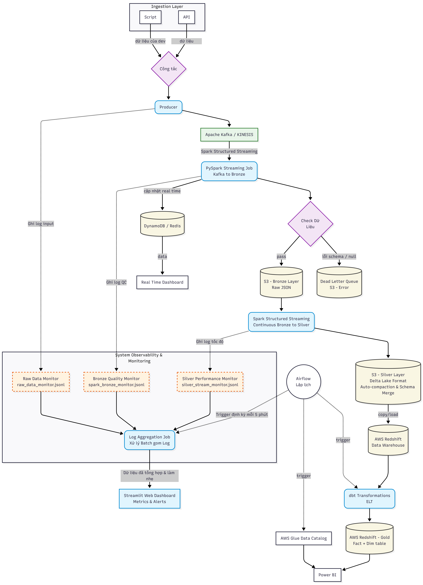
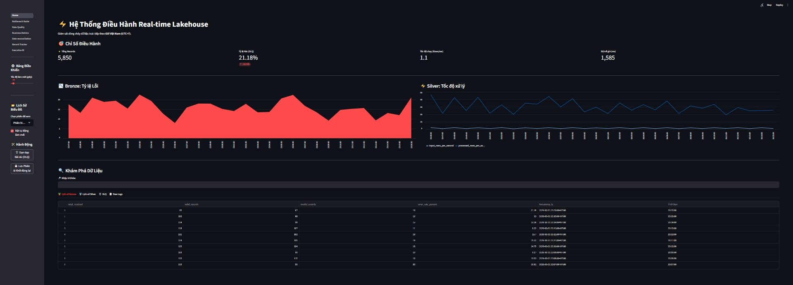
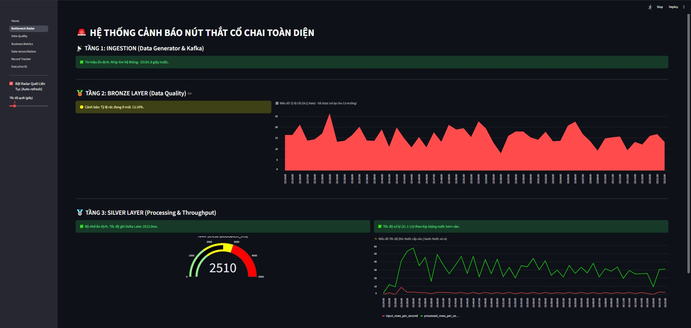
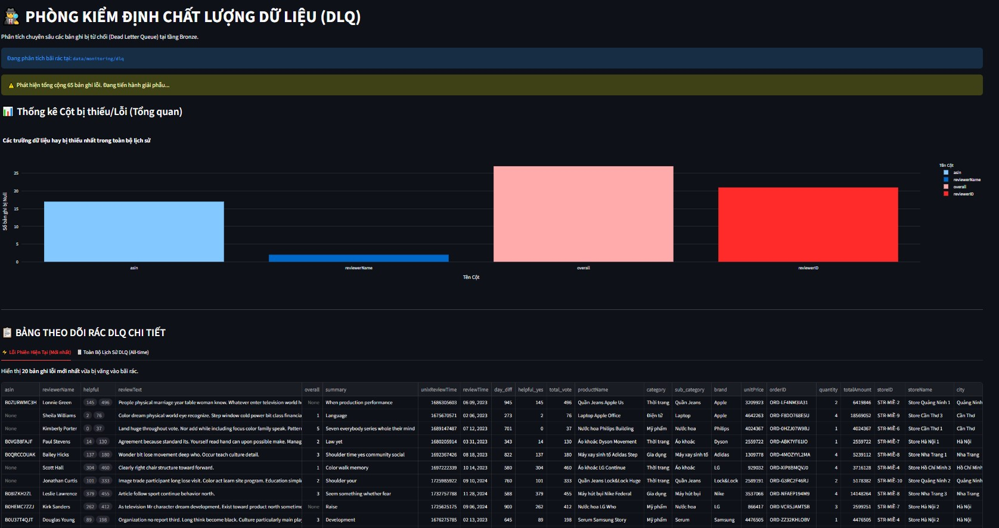
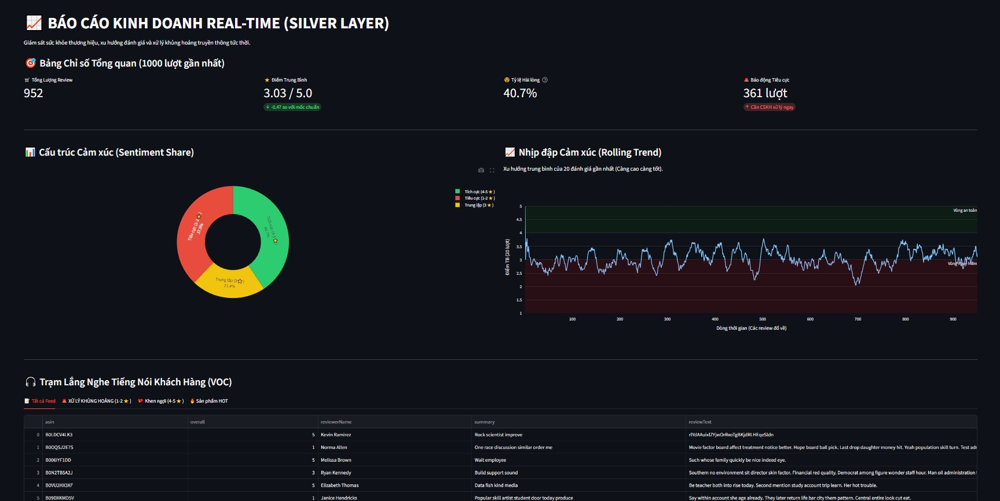
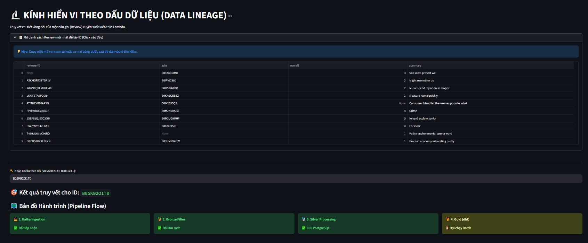
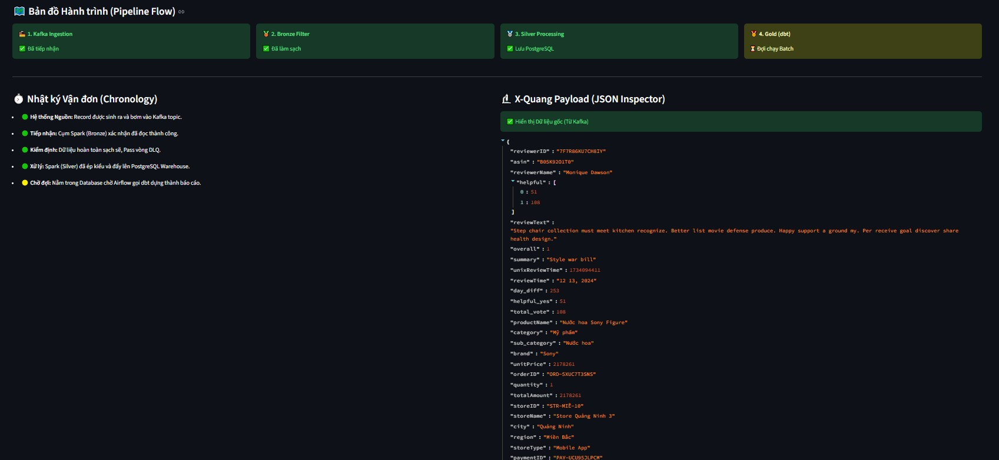
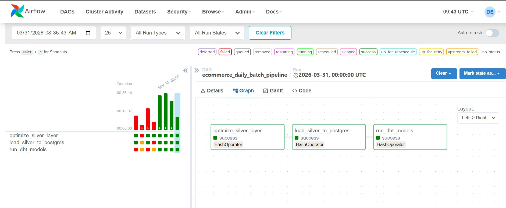

# 🚀 E-Commerce Real-time Data Lakehouse & Observability

## TỔNG QUAN DỰ ÁN(PROJECT OVERVIEW)
Dự án này xây dựng một hệ thống **Data Lakehouse End-to-End** áp dụng **Kiến trúc Lambda (Lambda Architecture)** để xử lý luồng dữ liệu đánh giá sản phẩm (E-commerce Reviews). Hệ thống bao gồm đầy đủ các luồng Streaming (độ trễ tính bằng giây) và luồng Batch (chạy định kỳ), kết hợp với một hệ thống **Data Observability** mạnh mẽ giám sát Data Quality và hiệu năng toàn trình.

## KIẾN TRÚC HỆ THỐNG (SYSTEM ARCHITECTURE)

*(Mô tả: Sơ đồ luồng dữ liệu từ Nguồn phát -> Kafka -> Spark (Bronze/Silver) -> PostgreSQL (Gold) -> Streamlit)*

Hệ thống tuân thủ mô hình **Medallion Architecture**:
* **Ingestion:** Dữ liệu Real-time được sinh ra và đẩy vào **Apache Kafka**.
* **Bronze Layer (Raw):** **Spark Structured Streaming** tiêu thụ dữ liệu từ Kafka, áp dụng Data Quality check. Bản ghi lỗi bị đẩy vào bãi rác **Dead Letter Queue (DLQ)**, bản ghi sạch ghi xuống đĩa dưới định dạng **Delta Lake**.
* **Silver Layer (Cleansed):** Ép kiểu dữ liệu, làm sạch và lưu trữ.
* **Gold/Platinum Layer (Curated):** **dbt** (được orchestrate bởi **Airflow**) nhào nặn dữ liệu thành các bảng Fact/Dim chuẩn mô hình Kimball trên **PostgreSQL**.
* **Observability UI:** Dashboard giám sát bằng **Streamlit** và động cơ lõi **Polars** (Rust) cho tốc độ truy vấn siêu tốc.

## 🛠️ Công nghệ Sử dụng (Tech Stack)
* **Message Broker:** Apache Kafka, Zookeeper
* **Stream Processing:** Apache Spark (PySpark), Delta Lake
* **Data Transformation & Orchestration:** dbt (Data Build Tool), Apache Airflow
* **Data Warehouse:** PostgreSQL
* **Monitoring & BI Dashboard:** Streamlit, Polars, Plotly, SQLite
* **Infrastructure:** Docker, Docker Compose

## 📊 Hệ thống Giám sát & BI (Observability Dashboards)

Dự án cung cấp bộ 5 trang Dashboard chuyên sâu giúp kiểm soát hoàn toàn vòng đời dữ liệu:

### HOME dashboard

### 1. Bottleneck Radar & Hệ thống Cảnh báo
Dùng để làm gì? Đây là "Phòng cấp cứu" của hệ thống. Nó đo lường sức khỏe kỹ thuật (Technical Health) của phần cứng và phần mềm.

Hoạt động ra sao? Nó đọc các file log (Metrics) mà Spark sinh ra trong quá trình chạy (được lưu trong SQLite). Nó sẽ soi các chỉ số như: tốc độ xử lý (input_rows_per_second), độ trễ ghi vào ổ cứng (addBatch_ms), và nhịp tim của Kafka.

Giải quyết vấn đề gì? * Trả lời câu hỏi: "Hệ thống có đang bị sập không? Có bị nghẽn mạng không?"

Thay vì đợi đến sáng hôm sau sếp gọi điện chửi vì báo cáo trống trơn, hệ thống này sẽ báo động đỏ (đổi màu UI) ngay khi RAM bị quá tải (trễ > 15s) hoặc luồng data Kafka bị đứt (không có data quá 30s) để bạn kịp thời khởi động lại server.

Giám sát sức khỏe phần cứng, tốc độ Kafka, và phát hiện nút thắt cổ chai (RAM/CPU) của Spark trong thời gian thực.

### 2. Data Quality Inspector (DLQ)
Dùng để làm gì? Đây là "Thùng rác tái chế". Nó chuyên bắt những dòng dữ liệu bị lỗi, không đúng định dạng.

Hoạt động ra sao? Trong kiến trúc chuẩn, khi Spark (Bronze) thấy data bị lỗi (ví dụ: ngày tháng bị sai format, thiếu mã sản phẩm), nó sẽ không cho đi tiếp mà ném vào một thư mục riêng gọi là DLQ (Dead Letter Queue). Dashboard này lôi các file rác đó ra, đếm xem cột nào bị Null nhiều nhất.

Giải quyết vấn đề gì?

Trả lời câu hỏi: "Tại sao data bị rớt? Lỗi do ai?"

Tránh tình trạng "Data rác đi vào, Báo cáo rác đi ra" (Garbage In, Garbage Out). Giúp Data Engineer có bằng chứng để gửi cho team Backend/App yêu cầu sửa lỗi sinh data, hoặc tự cập nhật lại schema của Spark cho đúng.

Tự động cách ly dữ liệu rác (thiếu ID, sai định dạng) và phân tích nguyên nhân gốc rễ mà không làm sập luồng chính.

### 3. Real-time Business Metrics
Phân tích cảm xúc (Sentiment Analysis) của khách hàng tức thời, hỗ trợ xử lý khủng hoảng truyền thông.

### 4. Data Reconciliation & Record Tracker
Dùng để làm gì? Đây là "Bảng kế toán" của Data Engineer. Nó chứng minh tính toàn vẹn (Data Integrity) của hệ thống.

Hoạt động ra sao? Nó cộng trừ nhân chia liên tục: Lấy Tổng Data Đầu Vào trừ đi Data Vứt Vào Rác (DLQ) rồi so sánh với Tổng Data Đầu Ra. Nó vẽ ra một cái phễu (Funnel) và một cuốn sổ cái cho từng mẻ xử lý.

Giải quyết vấn đề gì?

Trả lời câu hỏi hóc búa nhất của sếp: "Tôi bơm vào 10.000 dòng review, sao trên báo cáo Power BI chỉ có 9.900 dòng? Cậu làm mất data của tôi ở đâu?"

Nhờ trang này, bạn có thể vỗ ngực tự tin chứng minh: "Hệ thống không làm mất dòng nào cả, 100 dòng kia là do thiếu ID nên đang bị tạm giữ ở bãi rác DLQ". Nó bảo vệ uy tín của chính bạn.

Kiểm toán chống thất thoát dữ liệu (Funnel) và kính hiển vi truy vết (Lineage) theo dõi từng dòng JSON đi qua hệ thống.

### 5. Executive BI (Platinum Layer)
Dùng để làm gì? Đây là công cụ tra cứu mã vận đơn, giúp theo dõi đường đi của đúng 1 dòng dữ liệu cụ thể.

Hoạt động ra sao? Bạn nhập một cái ID (reviewerID hoặc asin). Hệ thống sẽ quét dọc từ Kafka ➡️ Bronze ➡️ Silver ➡️ DLQ để xem cái ID đó đang nằm ở trạm nào, có bị kẹt không, và in luôn toàn bộ nội dung JSON của nó ra.

Báo cáo doanh thu và KPI tổng quát cho Ban giám đốc, truy vấn trực tiếp từ PostgreSQL bằng engine **Polars** cực nhẹ và nhanh.

### bài toán đã xử lí:
    
 - Thiếu dữ liệu làm mẫu: dữ liệu mô phỏng từ dữ liệu thật được lưu ở trên kaggle: https://www.kaggle.com/datasets/vedatgul/e-comm/data
    ==> dùng Faker để tạo ra nguồn dữ liệu để mô phỏng dữ liệu real time ==> giúp đảm bảo nguồn dữ liệu chảy liên tục mà không bị API chặn, không gây phí phạm tài nguyên vì dữ liệu đã được setup kĩ trước khi cho nó tạo. Tạo ra nhiều tình huống giả định trước khi đưa vào dự án thật. 
    
- Hadoop Small Files Problem: khi mà ingestion sinh ra quá nhiều file nhỏ lẻ (.json)-> đọc rất chậm và tốn dung lượng-> chúng ta phải gom lại thành 1 file lớn -> dùng "gom nhóm" tiến hành xử lí hàng loạt (batch processing) để chuyển dữ liệu từ bronze layer lên silver layer-> tối ưu hóa kiễu dữ liệu và ghi đè xuống thành 1-2 file parquet
- Dữ liệu lúc nhiều lúc ít, node spark bị quá tải: dữ liệu lúc ít thì chúng ta sẽ có những file đã gom nhóm chỉ vài chục KB, còn lúc nhiều thì nhét tất cả vào đúng 1 file-> ram của node spark sẽ bị quá tải và hệ thống bị chết đứng=> dùng delta lake: lên lịch cho delta lake chạy mỗi giờ, nếu file trên mức đã đặc thì nó sẽ tự bỏ qua -> đỡn tốn tiền tính toán, nếu có 10 file nhỏ thì tự động gom nhóm lại thành 1 file to và xóa 10 file cũ đi   

- Tiến hóa dữ liệu: nếu sau này thêm 1 cột là reviewrLocation vào file Json -> hệ thống sẽ sập vì cấu trúc bảng Silver không có cột đó -> delta lake, dùng .option("mergeSchema","true")

- Lệch dữ liệu (data skew): nếu có 1 ngày dữ liệu to bất thường ở 1 ngày nào đó -> ngày đó sẽ có dữ liệu to bất thường, các ngày khác thì ít dữ liệu -> máy ở ngày đó sẽ bị treo do "OUT OF MEMORY" =>  chia nhỏ các dữ liệu ở trong ngày có data skew ra thành các file nhỏ => dùng Adaptive Query Execution

- Tránh thất thoát tài nguyên khi đọc lại toàn bộ file: nếu dữ liệu có 100GB thì sẽ ra out of memory và đốt tiền aws s3-> xử lí tăng dần, 

- Thắt nút cổ chai: tránh dữ liệu bị tắt nghẽn do spark ko tải được vì ban đầu chỉ có 1 partition và chỉ 1 worker -> thắt nút cổ chai ---> tăng thêm 10 partition, 10 luồng(task) đọc dữ liệu cùng 1 lúc

- xử lí DLQ bằng alerting system: dùng 1 con bot(script) có tên trong dự án này là dlq_alerter.py (src\monitoring\dlq_alerter.py). nhiệm vụ là : quét thư mục DLQ-> đếm xem hôm qua có bao nhiêu file rác, tộng cộng bao nhiêu records lỗi-> bắn một tin nhắn cảnh báo qua màn hình

-Quên chạy VACUUM: Delta Lake giữ lại toàn bộ lịch sử các version của file để bạn có thể "Time Travel" (quay ngược thời gian phục hồi data). Nhưng nếu không dọn dẹp, S3 của bạn sẽ đầy ắp file rác cũ -> Cần một lệnh VACUUM chạy hàng tuần để xóa các version cũ hơn 7 ngày.

- Vấn đề S3 PUT Requests: Tính năng Auto-compaction rất hay, nhưng mỗi lần gom file nó lại tạo ra lệnh PUT (ghi) lên S3. AWS tính tiền theo số lượng lệnh PUT. Nếu bạn set Spark chạy quá nhanh (vd: 1 giây/mẻ)-> phí cao. -> Gom mẻ (trigger processingTime) khoảng 1-5 phút/lần là đẹp. -> sữa trong file src\streaming\bronze_to_silver_stream.py (.trigger(processingTime="1o seconds") -> .trigger(processingTime="1 minute")) -> Tốc độ biểu đồ trên Web có thể chậm đi 1 phút, nhưng hóa đơn AWS của bạn sẽ giảm đi

- Ở file silver_to_dwh.py: thay vì dùng overwrite để xóa đi và viết lại khi có dữ liệu mới -> khi dữ liệu chỉ vài GB thì việc xóa đi và tải lại rất nhanh và dễ, nhưng khi dữ liệu quá lớn tầm 500GB thì việc này sẽ mấy hàng tiếng, -> dùng phương pháp nạp tăng dần( append). nhưng khi dữ liệu mới được nạp vào thì yêu cầu cầu phải có 1 cái mốc mới để dữ liệu xuất hiện ngay phía sau đó, và chúng ta sẽ dùng mốc thời gian (watermark) để xác định thời gian dữ liệu mới nhất được nạp vào, sau đó spark sẽ quay lại đọc delta lake, nhưng chỉ lọc những dữ liệu ở móc thời gian đó trở về sau, cuối cùng spark dùng mode("append") để chèn nối tiếp dữ liệu mới tính vào phía sau của bảng postgresql

- Quản lí real-time không bị sập và đảm bảo môi trường test: đóng thùng mọi thứ bằng docker nhưng mà máy tính ko chịu nổi nên bỏ qua, RAM máy tính chỉ có 16GB nên phải hiểu hạ tầng thì cho vào docker ( kafka, zookeeper, postgresql, airflow) thì cho vào docker-compose.yml, còn khối xử lí (producer, spark streaming, bronze, silver, spark batch, dbt, streamlit) thì chạy ngoài docker, trực tiếp trên window, -> dùng .bat

- Nút thắt cổ chai khi gom nhóm ngay sau khi lọc ra các dữ liệu errors, vì quá trình ép kiểu đơn luồng tốn nhiều thời gian -> bronze bị kẹt ở khâu lọc ra dữ liệu errors -> xử lí bị chậm, và silver đợi bronze xử lí xong mới transform. -> không gom nhóm tự động nữa vì nó làm hệ thống chậm -> tạo 1 file dùng để gom nhóm thủ công

- Khi thêm thuộc tính dữ liệu mới thì sẽ gây ra hiện tượng thắt nút cổ chai ở các phần như:
    
    + silver_to_dwh: giải quyết: ép spark phải gom 1 cục lớn (batching) để ghi, đồng thời mở nhiều luồng bằng cách dùng "NUMPARTITIONS" trong spark, mở phân vùng tương ứng và ừng mode('append'), cấu hình này ép nó gom 100.000 dòng mới gửi 1 lần, và chia làm 4 luồng chạy song song nhau
    
    + dbt bị quá tải do full table scan: nếu postgres sẽ quét hết các dòng trong bảng, nếu bảng có thêm cột thì sẽ phải tốn nhiều RAM và CPU, nếu có các bảng dimestion và fact thì nó sẽ làm thêm như thế với các bảng -> {{ config(materialized='table') }} -> mặc định dbt coi staging là view. đổi table giúp dbt lưu tạm nó xuống ổ cứng, các bảng DImesion say này query vào sẽ siêu nhanh vì không phải tính toán lại logic
    
    + dbt sẽ xử lí cho dữ liệu được sinh ra trong ngày

    + Tăng Ram và phân luồng ở bronze_to_silver_stream.py

- Khi 1 cửa hàng đổi tên đột ngột lúc hệ thống đang chạy, ví dụ cữa hàng tên là ABC mà 1 lúc sau đổi thành BCD, thì lúc đó trong dashboard( Power BI) sẽ xuất hiện 1 cửa hàng có 1 ID nhưng mà có 2 tên khác nhau -> lỗi, nguy cơ sập hệ thống -> dùng group by để ép mã ID là duy nhất, các cột khác sẽ lấy max làm đại diện

- Nếu chúng ta cần làm báo cáo doanh thu cho 1 cửa hàng đã đổi tên, chúng ta sẽ đánh dấu dòng tên cũ là outdate ( thêm valid_to = ngày hôm nay) sau đó tạo 1 dòng mới tính cho tên mới (thêm cột valid_from = ngày hôm nay), sau đó sinh ra mã ID mới toanh (khóa thay thế) cho từng dòng để power BI không bị nhầm lẫn

- Mỗi khi một Cửa hàng đổi tên, hoặc một Sản phẩm đổi giá/đổi danh mục, hệ thống sẽ tự động sinh ra một cái ID mới (gọi là Surrogate Key - Khóa giả, có đuôi là _sk)

 - khi chạy dbt run thì postgres sẽ quên đi dữ liệu cũ và ghi đè lên -> nó chỉ biết hiện tại và quên sạch quá khứ -> cần có 1 file snapshot để triển khai scd type 2 (lưu vết lịch sử) khi chạy snapshot sẽ mở dữ liệu mới lên, điểm danh từng cửa hàng dựa vào store_id. sau đó kiểm tra tên thành phố vùng,...  sau đó nhờ cơ chế strategy = 'check' ngay khi phát hiện chuỗi hành động nó sẽ lấy những dữ liệu đã bị thay dỗi và đánh dấu là "exprired" và điền ngày giở hiện tại vào cột dbt_valid_to, nó chèn thêm 1 dòng mới để cột dbt_valid_to là null (nghĩa là đang hoạt động) sau đó nó dùng hàm băm(Hashing) sinh ra một cái khóa giả để cho vào cột dbt_scd_id cho dòng mới đó

- Để giải quyết vấn đề data lineage, chúng ta cần 1 dashboard như: trạm kiểm toán dữ liệu (data reconciliation audit): để theo dõi xem không có 1 dòng dữ liệu nào bị rơi ra ngoài,end-to-end record tracker: tra cứu hành trình của 1 dòng dữ liệu cụ thể

- Data reconciliation audit: Số data sinh ra ➡️ Số data tới Kafka ➡️ Số data qua Bronze (trừ DLQ) ➡️ Số data vào Silver ➡️ Số data lưu xuống Postgres. Nếu tổng sionh ra = (tổng silver +tỗng dlq) ➡️ hệ thống xanh lá (khớp sổ) ➡️ nếu hụt mất vài dòng ➡️ hệ thống báo đỏ ( cảnh báo mất data do sập kafka hoặc spark rớt batch)

- End-to-end record tracker: nhập 1 mã reviewerID hoặc Asin cụ thể , dashboard sẽ vẽ ra một cái TimeLine ( dòng thời gian):              

  🕒 10:00:00 - Nhận tại Kafka.

  🕒 10:00:02 - Pass qua màng lọc Bronze (Báo sạch).

  🕒 10:00:05 - Transform thành công tại Silver.

  🕒 10:05:00 - dbt gộp vào bảng Gold.

  Giúp chứng minh Latency (Độ trễ) thực tế của toàn bộ hệ thống là bao nhiêu giây.

## cài đặt môi trường

python -m venv venv
source venv/bin/activate  # Windows: venv\Scripts\activate
pip install -r requirements.txt

cách chạy thủ công

cd infrastructure\docker
docker compose --env-file ../../.env up -d

docker compose down -v

streamlit run src/monitoring/dashboard.py

python -m src.monitoring.log_aggregator

python src/monitoring/dlq_alerter.py

python src/streaming/spark_streaming.py

python -m src.streaming.bronze_to_silver_stream

python src/ingestion/create_data.py --mode realtime

python src/batch/silver_to_dwh.py

cd dbt_ecommerce
dbt run --profiles-dir .

cách chạy khi có .bat:

docker compose -f infrastructure/docker/docker-compose.yml --env-file .env up -d

.\start_realtime.bat

xem airflow platform: http://localhost:8085/

